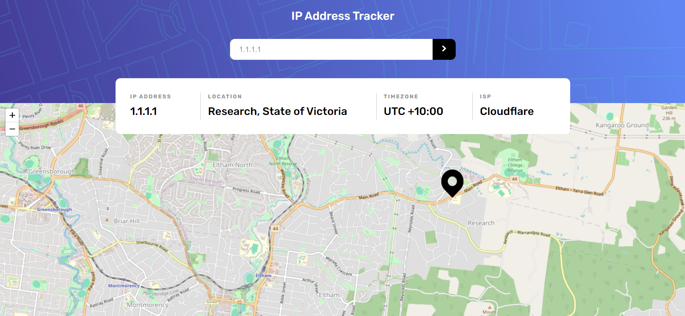

# Frontend Mentor - IP address tracker solution

This is a solution to the [IP address tracker challenge on Frontend Mentor](https://www.frontendmentor.io/challenges/ip-address-tracker-I8-0yYAH0). Frontend Mentor challenges help you improve your coding skills by building realistic projects. 

## Table of contents

- [Overview](#overview)
  - [The challenge](#the-challenge)
  - [Screenshot](#screenshot)
  - [Links](#links)
- [My process](#my-process)
  - [Built with](#built-with)

## Overview

### The challenge

Users should be able to:

- View the optimal layout for each page depending on their device's screen size
- See hover states for all interactive elements on the page
- See their own IP address on the map on the initial page load
- Search for any IP addresses or domains and see the key information and location

### Screenshot

### Links

- Solution URL: [Add solution URL here](https://github.com/melikealtin/frontend-mentor-challenges/blob/main/ip-address-tracker-master/src/App.vue)
- Live Site URL: [Add live site URL here](https://frontend-mentor-challenges-wheat-eight.vercel.app/)

## My process

### Built with

- Semantic HTML5 markup
- CSS custom properties
- Flexbox
- Mobile-first workflow
- Vue 3 Composition API
- Leaflet - Open-source JavaScript library for mobile-friendly interactive maps
- Ipify - A simple public IP address API for developers, used for fetching the user's IP address in this project
- Axios - Promise based HTTP client for the browser and node.js
- Vite - Build tool that aims to provide a faster and leaner development experience for modern web projects

